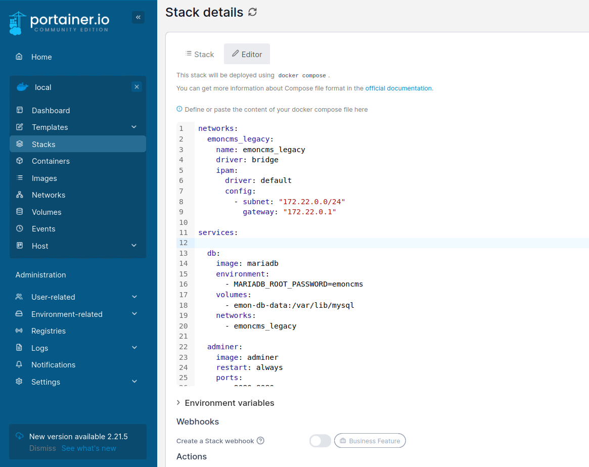
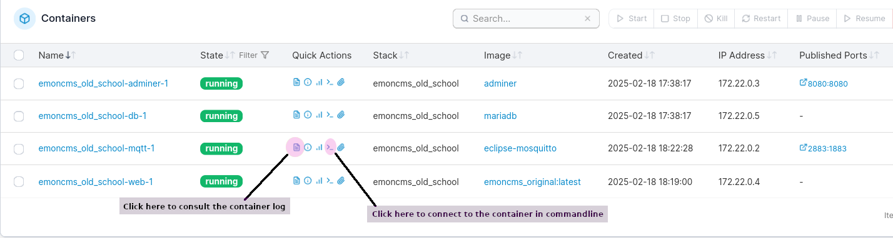
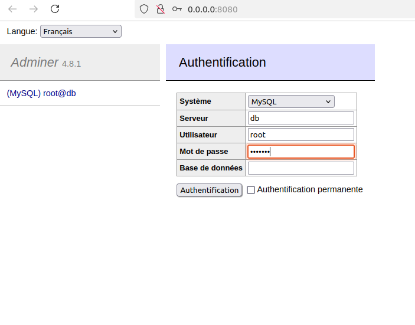

# How to use the compose file ?

From this folder, initialize the `/emoncms_conf` folder. Permissions are given to the current host user but this is not necessary.
```
sudo mkdir /emoncms_conf
sudo chown $USER /emoncms_conf/
cp -R -f emoncms_conf /
```

Use the compose file to run the stack in Portainer or with docker compose.

[Portainer](https://docs.portainer.io/start/install-ce/server/docker/linux) is a good choice for those who dont want to do things in command line.




If you don't use redis, You will have 4 running containers on a network called emoncms_legacy, using a subnet in `172.22`: 
- web,
- db,
- mqtt,
- adminer, which is a light version of phpmyadmin



Connect to adminer through the web ui to create :
1) the `emoncms` database,
2) the `emoncms` user which you grant the rights on the stack network, here `172.22.0.*`

```
CREATE USER 'emoncms'@'172.22.0.%' IDENTIFIED BY 'emonpiemoncmsmysql2016';
GRANT ALL ON emoncms.* TO 'emoncms'@'172.22.0.%';
flush privileges;
```



Of course, you can secure things like that :

```
DELETE FROM mysql.user WHERE User='root' AND Host NOT IN ('localhost', '127.0.0.1', '::1');
```

Connect in cli to the mqtt container and replace username and password by what you want, so to be secure :

```
mosquitto_passwd -b /etc/mosquitto/passwd "emonpi" "emonpimqtt2016"
```
Restart the mqtt container to activate credentials

To interrogate the broker, there is a really super tool called [MQTT explorer](http://mqtt-explorer.com/) : if you are beginning with all those iot stuff, use it ! To connect to the broker running on the mqtt container, use the credentials, 127.0.0.1 for the host and 2883 for the port

## not necessary, just to be sure to understand how things works

Connect in cli to the web container and install mariadb-client : `apt-get install mariadb-client`

Then check the database `mysql -h db --user=emoncms --password=emonpiemoncmsmysql2016`

# how to build

As the build is automated, this is only for general knowledge

```
docker build --build-arg="BUILD_FROM=php:8.2.27-apache" -t emoncms_legacy_docker .
```
It will produce on your computer an image called `emoncms_legacy_docker`
